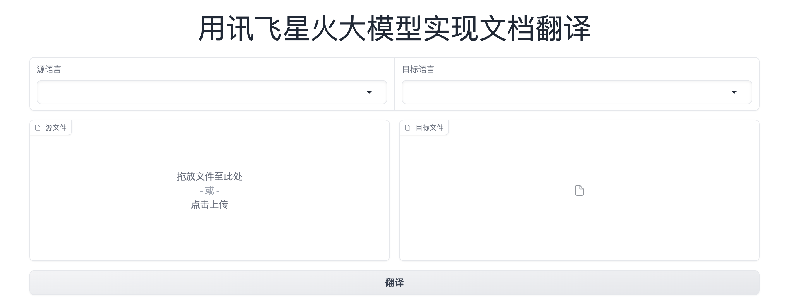

### 文档翻译

使用讯飞星火大模型实现文档翻译。

### 开始

1. 创建 python 虚拟环境，并激活。

+ conda create -n doc_translation python=3.9
+ conda activate doc_translation

2. 安装依赖。

+ pip install -r requirements.txt

3. 进入 src 文件夹，修改 config.py 文件，填入自己的 **SPARK_APPID、SPARK_API_KEY 和 SPARK_API_SECRET**。
	
 	密钥获取方式：
  
	(1). 领取：https://xinghuo.xfyun.cn/sparkapi    在该页面点击“免费领取”按钮即可领取。
 
	(2). 复制密钥：https://console.xfyun.cn/services/bm2   在该页面可以查看并复制密钥信息。

5. 运行：python doc_translation.py，运行界面如下图所示：

